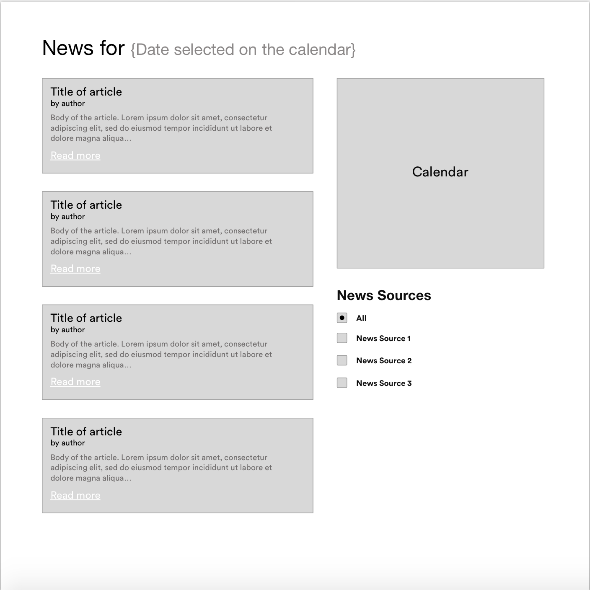
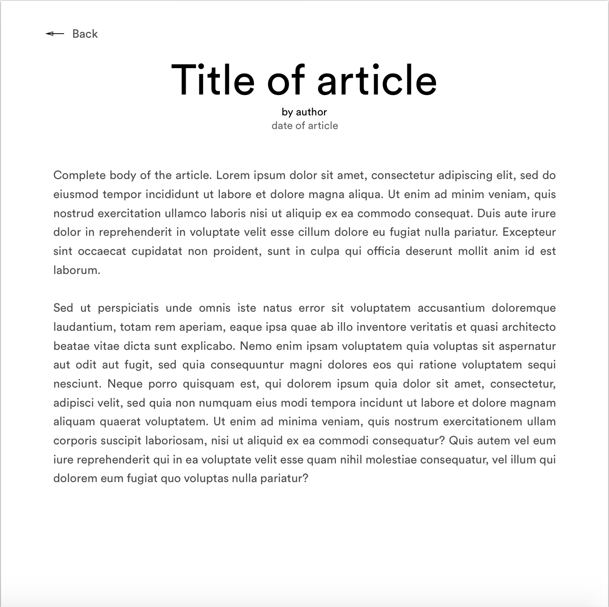

Coding Challenge | Appico
=============================================

The test should be done in React with the following external dependencies:
 - React Router v4. For routing to the detail page.
 - Material UI. To make it easier for you on the design part, you can use this library to create the elements needed. https://material-ui-next.com/getting-started/installation/

You could add more external dependencies, but they should only be the ones you really feel that you need.

### Article list:


The main screen contains:
- A big title which has a dynamic date field (the date selected on the right calendar)
- On the right side you have a calendar (the calendar can be done with or without external component)
- A list of articles for the selected dates. The articles can be fetched at this API https://newsapi.org/ (It has a free plan for developers).
- Below the calendar we have a few checkbox to filter the news.
You can pick three news sources (from here https://newsapi.org/sources) and put them there so the list can be filtered by them. This should be done through the call to the API, instead of filtering the response.

#### Features:
The idea is simple:

> We start with the calendar displaying the date of today.

> The left list contains up to 10 (max) of the top news of today (https://newsapi.org/docs/endpoints/top-headlines)

> You can change the date of the calendar and therefore the news displayed should change for that date as well.
You could select more than one day (a period) in the calendar, like from 13/11/17 - 15/11/17. That should give you the top news between those two dates.

> When changing the filters below the calendar the list of news changes accordingly. When selecting one or more of the three possible news resources the ‘all’ checkbox goes unselected. And if unchecking the three news resources the ‘all' should get checked.

### Article detail:

#### Features:
> When clicking on the ‘Read more’, the title or the copy of the article, it should change the screen to the article detail.

> In the detail page we basically show the same information of the selected article but expanded.

> There is also a back arrow to go back to the main screen.

## Execution:
My app is deployed on [Heroku](https://appico-news.herokuapp.com/)

### Tech Stack:
| **Frontend** | **Backend** |
| ------ | ------ |
**[React.js]** | **[Node.js]** |
**[Redux.js]** | **[Express.js]** |


### Requirements:


## Installation
to run the code locally follow these installation instructions:
- install Node.js;

```bash
$ git clone https://github.com/suddenlyGiovanni/coding_challenge-appico.git
$ cd coding_challenge-appico
$ npm install
$ cd client
$ npm install
$ cd ../server
$ mkdir config
$ cd config && touch secrets.json
```

##### secret.json

```javascript
{}
```

## How to Run it locally:
Then in a new tab/terminal run:
```bash
$ npm run development
```


## Features:

## Contact
* e-mail: ravalico.giovanni@gmail.com
* Twitter: [@superspacezova](https://twitter.com/superspacezova "twitterhandle on twitter")
* LinkdeIn: [/giovanni-ravalico]
* Facebook: [/RavalicoGiovanni](https://www.facebook.com/RavalicoGiovanni)

License
----
MIT © [suddenlyGiovanni]
**Free Software, Hell Yeah!**


[//]: # (These are reference links used in the body of this note and get stripped out when the markdown processor does its job. There is no need to format nicely because it shouldn't be seen. Thanks SO - http://stackoverflow.com/questions/4823468/store-comments-in-markdown-syntax)

[//]: # (Contact references:)
   [suddenlyGiovanni]: <https://github.com/suddenlyGiovanni/>
   [/giovanni-ravalico]: <https://www.linkedin.com/in/giovanni-ravalico/>
   [@superspacezova]: <https://twitter.com/superspacezova>

[//]: # (Tech Stack references:)
   [React.js]: <https://reactjs.org/docs/installation.html>
   [Node.js]: <https://nodejs.org/dist/latest-v8.x/docs/api/>
   [Redux.js]: <http://redux.js.org/>
   [Express.js]: <http://expressjs.com/en/4x/api.html>
